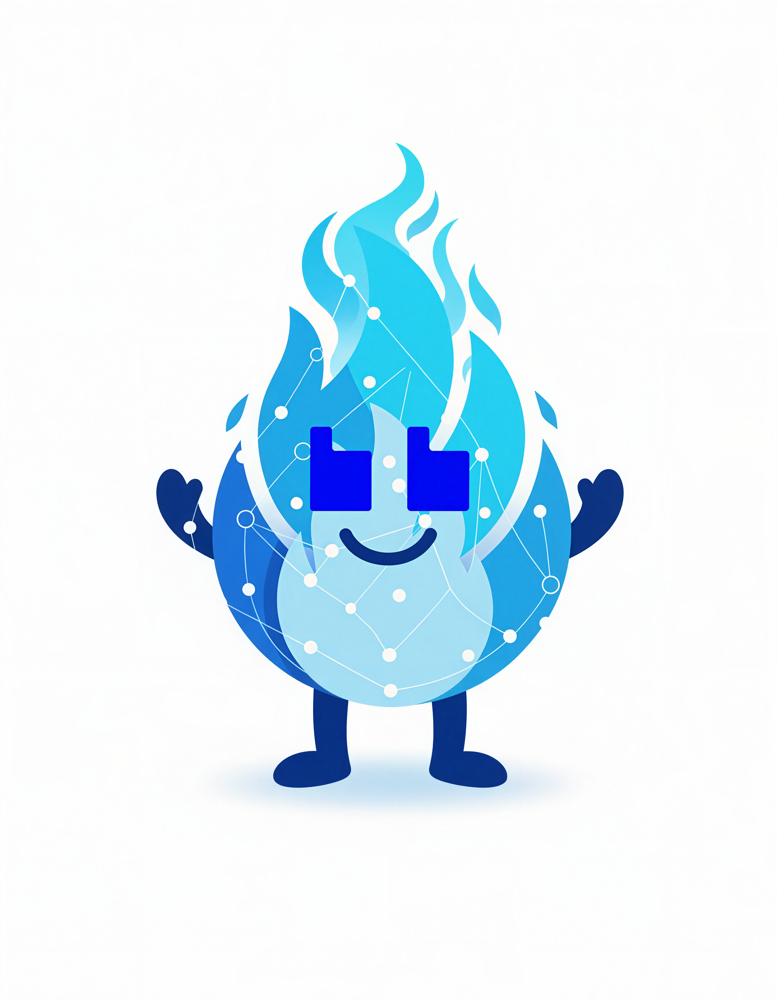
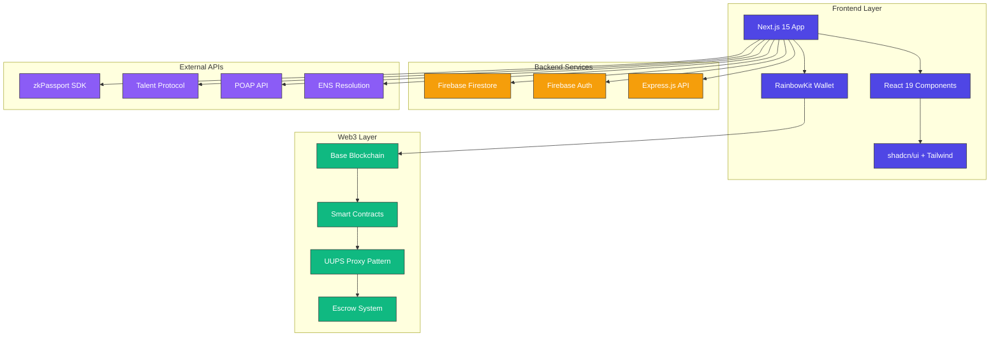
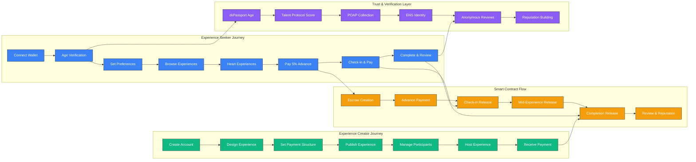

# 🔥 FlamaBB Frontend Application

**Next.js 15 + TypeScript + Web3 Social Experience Platform**

*Built entirely with v0 by Vercel for the [Aleph Hackathon](https://dorahacks.io/hackathon/aleph-hackathon/detail)*



## 🚀 Quick Start

### 📱 Experience the Live App
**👉 [https://flamabb.vercel.app](https://flamabb.vercel.app) 👈**

### 🛠️ Local Development

```bash
# Clone and install
git clone https://github.com/your-team/flamabb
cd flamabb/FlamaBBApp
npm install

# Run development server
npm run dev

# Open browser
# Navigate to http://localhost:3000
```

## 🏗️ Technical Architecture

FlamaBB is a modern Web3 social application built with cutting-edge technologies and best practices for performance, security, and user experience.

### System Architecture Diagram



### User Role & Workflow Diagram



## 🎯 Hackathon Tracks

This project is submitted to multiple tracks of the Aleph Hackathon:

- **[Base Track](https://dorahacks.io/hackathon/aleph-hackathon/base)** - Built on Base blockchain for transparent and efficient transactions
- **[v0 by Vercel Track](https://dorahacks.io/hackathon/aleph-hackathon/v0-by-vercel)** - Developed entirely using v0 for rapid prototyping and beautiful UI
- **[ENS Track](https://dorahacks.io/hackathon/aleph-hackathon/ens)** - Utilizing ENS as resolver for POAP count and Talent Protocol data

## ✨ Key Features

### 🔐 User Authentication & Verification
- **Wallet Connection**: Seamless Web3 wallet integration
- **Age Verification**: zkPassport integration ensuring users are 18+ years old
- **Profile Verification**: Talent Protocol scores and POAP collection display
- **Anonymous Profiles**: Privacy-first approach with nickname-based interactions

### 💝 Experience Discovery
- **Interest-Based Matching**: Users select preferences (food, bars, culture, etc.)
- **City-Focused**: Buenos Aires experiences including asados, bar tours, walking tours
- **Wishlist System**: Heart/like experiences to save for later
- **Community Engagement**: See flamitas (interest indicators) from other users

### 💰 Innovative Payment System
- **5% Advance Payment**: Show genuine interest by paying 5% of experience cost
- **Flexible Payment Structure**: Experience creators set check-in and mid-experience payment percentages
- **Transparent Escrow**: Smart contracts hold funds until experience completion
- **Automatic Distribution**: Seamless fund transfers based on participation milestones

### 🎨 Experience Creation
- **Easy Setup**: Multi-step flow for creating experiences
- **Flexible Pricing**: Set your own rates and payment structure
- **Participant Management**: Control maximum participants and requirements
- **Rich Media**: Add photos and detailed descriptions

### 📊 Community Features
- **Anonymous Reviews**: 1-5 flama rating system
- **Web3 Reputation System**: Real-time Talent Protocol scores and POAP collection counts
- **ENS Identity Resolution**: Optional ENS name and avatar display
- **Trust Indicators**: Verified Web3 reputation without compromising privacy
- **Privacy Controls**: Users remain anonymous while building reputation

## 🛠 Technology Stack

### Frontend
- **Next.js 15** - React framework with App Router
- **TypeScript** - Type-safe development
- **Tailwind CSS v4** - Modern styling with design system
- **shadcn/ui** - Beautiful, accessible UI components
- **v0 by Vercel** - AI-powered development platform

### Blockchain & Web3
- **Base Blockchain** - Layer 2 solution for efficient transactions
- **Smart Contracts** - Escrow and payment management
- **Wallet Integration** - Web3 wallet connectivity

### Identity & Verification
- **zkPassport** - Zero-knowledge age verification (18+ years)
- **ENS (Ethereum Name Service)** - Domain name resolution, avatar display, and identity verification
- **Talent Protocol API** - Real-time builder reputation scoring with API integration
- **POAP API** - Proof of Attendance Protocol collection statistics and verification

### Development Tools
- **v0 by Vercel** - Primary development platform
- **Vercel** - Deployment and hosting
- **Git** - Version control

## 🏗 Technical Architecture

### 📖 Problem Statement
FlamaBB addresses the fundamental trust gap in authentic travel experiences by solving the critical problem of how strangers can safely connect for genuine local activities. Traditional tourism relies on overpriced, inauthentic experiences that funnel travelers into tourist traps, while real locals with insider knowledge of hidden gems, authentic restaurants, and cultural activities have no platform to safely monetize their expertise. The core challenge is establishing trust between travelers and locals without compromising privacy or safety - travelers need authentic experiences but risk scams, while locals want to share their knowledge but face safety concerns about meeting strangers.

### 🛠 Technical Implementation
FlamaBB is built as a full-stack Web3 application using a modern technical architecture that combines blockchain transparency with privacy-preserving user experience. The frontend is a Next.js 15 application with React 19 and TypeScript, featuring a comprehensive onboarding wizard with wallet-based authentication using wagmi 2.16.9 and RainbowKit 2.2.8 for seamless Web3 wallet integration across MetaMask, WalletConnect, and other providers. The application uses Firebase 12.2.1 for backend services including Firestore for user profiles and experience data, with security rules ensuring authenticated users can only access their own data while maintaining anonymous browsing capabilities. The UI is built with shadcn/ui components and Tailwind CSS v4 for a mobile-first, responsive design that features gradient backgrounds, card-based layouts, and smooth animations optimized for the Buenos Aires cultural aesthetic. Web3 integration centers on the Base blockchain (mainnet 8453, testnet 84532) for low-cost transactions, with smart contracts handling escrow payments and OnchainKit 0.38.19 providing Base network utilities. The authentication system transitions from traditional Firebase email/password to wallet-based authentication where users connect their Web3 wallet and the app uses the wallet address as the primary identifier, storing anonymous profiles in Firestore while enabling selective ENS identity reveal. External integrations include zkPassport SDK for zero-knowledge age verification, Talent Protocol API for Web3 reputation scoring, POAP API for community participation tracking, and ENS resolution for optional identity display. The architecture supports a 5-step onboarding flow (cities, interests, budget, profile, verifications) that creates anonymous user profiles while building Web3 reputation signals, ultimately enabling a trust system where strangers can safely book authentic local experiences through smart contract escrow without revealing personal information until they choose to do so.

### 🏗 System Architecture

\`\`\`
┌─────────────────┐    ┌──────────────────┐    ┌─────────────────┐
│   Frontend      │    │   Smart          │    │   External      │
│   (Next.js)     │◄──►│   Contracts      │◄──►│   Services      │
│                 │    │   (Base)         │    │                 │
│ • User Interface│    │ • Escrow         │    │ • zkPassport    │
│ • Wallet Connect│    │ • Payments       │    │ • ENS           │
│ • Experience UI │    │ • Experience     │    │ • Talent Proto  │
└─────────────────┘    └──────────────────┘    └─────────────────┘
\`\`\`

## 🚀 Getting Started

### Prerequisites
- Node.js 18+ 
- Web3 wallet (MetaMask, WalletConnect, etc.)
- Base network access

### Installation

1. **Clone the repository**
   \`\`\`bash
   git clone https://github.com/your-team/flamabb
   cd flamabb
   \`\`\`

2. **Install dependencies**
   \`\`\`bash
   npm install
   \`\`\`

3. **Set up environment variables**
   \`\`\`bash
   cp .env.example .env.local
   # Add your environment variables including:
   # - WalletConnect Project ID
   # - Firebase credentials
   # - Talent Protocol API key
   # - POAP API key (optional)
   # - Base Sepolia testnet RPC URLs
   # - ENS resolution RPC URL (mainnet)
   \`\`\`

4. **Run the development server**
   \`\`\`bash
   npm run dev
   \`\`\`

5. **Open your browser**
   Navigate to `http://localhost:3000`

## 🎮 How It Works

### For Experience Seekers
1. **Connect Wallet** - Link your Web3 wallet
2. **Complete Verification** - Age verification via zkPassport
3. **Set Preferences** - Choose interests and cities
4. **Discover Experiences** - Browse Buenos Aires activities
5. **Show Interest** - Heart experiences for your wishlist (free)
6. **Join Experience** - Pay 5% advance to secure your spot
7. **Participate** - Check-in and enjoy the experience
8. **Review** - Rate with 1-5 flamas anonymously

### For Experience Creators
1. **Create Account** - Set up your creator profile
2. **Design Experience** - Add details, photos, and pricing
3. **Set Payment Structure** - Configure check-in and completion percentages
4. **Publish** - Make your experience available
5. **Manage Participants** - Track registrations and payments
6. **Host Experience** - Lead your group activity
7. **Receive Payment** - Automatic fund distribution upon completion

## 👥 Team

Our diverse team of fullstack developers brings together expertise in Web3, frontend development, and user experience:

- **[Ileana](https://github.com/ileana-pr)** - Fullstack Developer
- **[0xOucan](https://github.com/0xOucan)** - Fullstack Developer  
- **[Julio M Cruz](https://github.com/JulioMCruz)** - Fullstack Developer

## 🔗 Important Links

### Hackathon
- [Aleph Hackathon Main](https://dorahacks.io/hackathon/aleph-hackathon/detail)
- [Base Track](https://dorahacks.io/hackathon/aleph-hackathon/base)
- [v0 Track](https://dorahacks.io/hackathon/aleph-hackathon/v0-by-vercel)
- [ENS Track](https://dorahacks.io/hackathon/aleph-hackathon/ens)

### Documentation
- [zkPassport Documentation](https://docs.zkpassport.id/intro)
- [zkPassport Age Verification](https://docs.zkpassport.id/examples/age-verification)
- [Base Documentation](https://docs.base.org/)
- [ENS Documentation](https://docs.ens.domains/)

## 🌟 Why FlamaBB?

### Innovation
- **First** Web3 platform specifically designed for urban experience sharing
- **Unique** payment structure that builds trust between strangers
- **Privacy-focused** while maintaining community accountability

### Social Impact
- **Community Building** - Connects people through shared interests
- **Local Economy** - Supports local experience creators and venues
- **Cultural Exchange** - Promotes authentic local experiences
- **Public Good Model** - Sustainable development with community giving back

### Technical Excellence
- **Built on Base** - Fast, cheap, and reliable transactions
- **Modern Stack** - Latest Web3 and frontend technologies
- **User-Centric** - Intuitive design built with v0

## 💻 Frontend Stack & Implementation

### 🎯 Core Technologies
- **Next.js 15.2.4** - Latest React framework with App Router architecture
- **TypeScript 5** - Full type safety and developer experience
- **Tailwind CSS 4.1.9** - Utility-first styling with custom design system
- **React 19** - Latest React features and concurrent rendering

### 🔗 Web3 Integration
- **wagmi 2.16.9** - React hooks for Ethereum interactions
- **RainbowKit 2.2.8** - Beautiful wallet connection UI
- **viem 2.36.0** - TypeScript Ethereum library
- **Base Network** - Layer 2 for fast, cheap transactions

### 🔐 Identity & Verification
- **zkPassport SDK 0.8.2** - Zero-knowledge age verification
- **QR Code Generation** - Mobile-friendly verification flow
- **ENS Integration** - Optional identity reveal system
- **Anonymous Profiles** - Privacy-first user experience

### 🎨 UI/UX Components
- **shadcn/ui** - High-quality, accessible React components
- **Radix UI** - Unstyled, accessible UI primitives
- **Lucide React** - Beautiful, consistent icon system
- **React Hook Form + Zod** - Type-safe form validation

### 📊 State Management
- **Local State (useState)** - Simple, effective state management
- **Props Drilling** - Clean data flow for small-medium app
- **React Query (Tanstack)** - Server state management
- **Local Storage** - Persistence for user preferences

## 🌐 Web3 Reputation Integration

### API Integrations
FlamaBB integrates with multiple Web3 APIs to provide comprehensive reputation data:

#### Talent Protocol
- **Real-time Builder Scores**: Display verified talent scores for wallet addresses
- **API Integration**: Direct API calls to Talent Protocol v2 endpoints
- **Score Formatting**: Format scores (e.g., 119 → "100+") for consistent display
- **Error Handling**: Graceful fallback when API is unavailable

#### POAP (Proof of Attendance Protocol)
- **Collection Statistics**: Show total POAP count and participation history
- **Event Filtering**: Filter POAPs by year, location, or specific events
- **Optimized Images**: Use compressed POAP artwork for better performance
- **Community Participation**: Demonstrate real-world event attendance

#### ENS (Ethereum Name Service)
- **Name Resolution**: Resolve wallet addresses to ENS names
- **Avatar Display**: Show ENS avatar images
- **Reverse Lookup**: Support ENS name to address resolution
- **Identity Verification**: Optional identity reveal for trusted interactions

### Usage in Components
```typescript
// Display reputation in profile
<Web3Reputation 
  walletAddress={address} 
  showDetailed={true}
/>

// Compact view for lists
<CompactWeb3Reputation walletAddress={address} />

// ENS profile display
<EnsProfileDisplay 
  address={address}
  showAvatar={true}
  showAddress={false}
/>
```

## 🔧 Development Workflow

### 🎨 Built with v0 by Vercel
This entire application was built using **v0 by Vercel**, showcasing the power of AI-assisted development:

- **Rapid Prototyping** - From idea to working prototype in hours
- **Component Generation** - AI-powered React component creation
- **Design Consistency** - Cohesive visual language across all screens
- **Best Practices** - Modern React patterns and accessibility

### 📁 Project Structure
```
FlamaBBApp/
├── app/                    # Next.js App Router
│   ├── layout.tsx         # Root layout with providers
│   ├── page.tsx           # Home page (Welcome Screen)
│   └── globals.css        # Global styles
├── components/            # React components
│   ├── ui/               # shadcn/ui components
│   ├── welcome-screen.tsx # Entry point
│   ├── age-verification.tsx # zkPassport integration
│   ├── onboarding-flow.tsx # 6-step user setup
│   ├── dashboard.tsx     # Main app interface
│   └── ...              # Feature components
├── hooks/                # Custom React hooks
├── lib/                  # Utilities and config
│   ├── utils.ts         # Tailwind utilities
│   └── wagmi-config.ts  # Web3 configuration
└── public/              # Static assets
```

### 🎯 Component Architecture
- **Functional Components** - Modern React with hooks
- **TypeScript Props** - Fully typed component interfaces
- **Compound Patterns** - Reusable, composable components
- **Accessibility First** - ARIA labels, keyboard navigation
- **Mobile Responsive** - Mobile-first design approach

### 🔄 User Flow Implementation
1. **WelcomeScreen** → Wallet connection (RainbowKit)
2. **AgeVerification** → zkPassport integration (QR + mobile)
3. **OnboardingFlow** → 4-step preference setup
4. **Dashboard** → Main app with bottom navigation
5. **Feature Screens** → Experience discovery, creation, booking

## 🌍 Public Good Commitment

FlamaBB operates as a **Public Good** with a sustainable and community-focused revenue model:

### 💰 Revenue Structure
- **Platform Fee**: 0.5% commission per experience booking
- **Soft Cap**: $1,000 USD monthly revenue target
- **Team Distribution**: $250 USD per developer (3 developers = $750 USD)
- **Infrastructure**: $250 USD for operational costs

### 🎁 Community Giving
Once we reach our monthly soft cap of $1,000 USD, **100% of additional revenue is donated** to local charitable causes:

- **Buenos Aires Focus**: Child cancer non-governmental organizations
- **Transparent Donations**: Public record of all charitable contributions
- **Community Choice**: Local communities help select beneficiary organizations
- **Global Expansion**: Similar local charity partnerships in each new city

This model ensures FlamaBB remains sustainable while maximizing positive social impact in every community we serve.

## 🚀 Performance & Optimization

### ⚡ Build Configuration
- **Static Generation** - Pre-rendered pages for optimal performance
- **Image Optimization** - Unoptimized for deployment flexibility
- **ESLint Disabled** - Development speed over strict linting
- **TypeScript Strict** - Type safety without build blocking

### 📱 Mobile Optimization
- **PWA Ready** - Progressive web app capabilities
- **Touch Friendly** - 44px minimum touch targets
- **Single Column** - Optimized for mobile screens
- **Gesture Support** - Swipe, tap, long press interactions

### 🔐 Security Considerations
- **No Sensitive Data** - Client-side only non-sensitive information
- **Web3 Security** - Wallet permissions and transaction validation
- **Privacy First** - Minimal data collection and storage
- **Anonymous by Default** - User privacy protection

## 🎉 Special Thanks

Huge appreciation to **v0 by Vercel** for making this project possible! The AI-powered development experience allowed us to rapidly prototype and build a beautiful, functional application in record time. We love you v0! 💙

## 📄 License

This project is licensed under the MIT License - see the [LICENSE](LICENSE) file for details.

## 🤝 Contributing

We welcome contributions! Please see our [Contributing Guidelines](CONTRIBUTING.md) for details.

---

**Built with ❤️ for the Aleph Hackathon | Powered by Base, v0, and ENS**