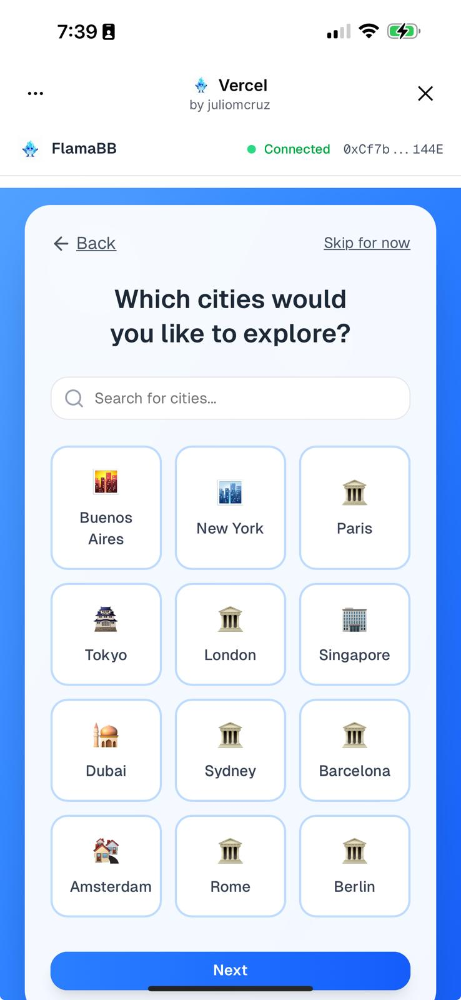
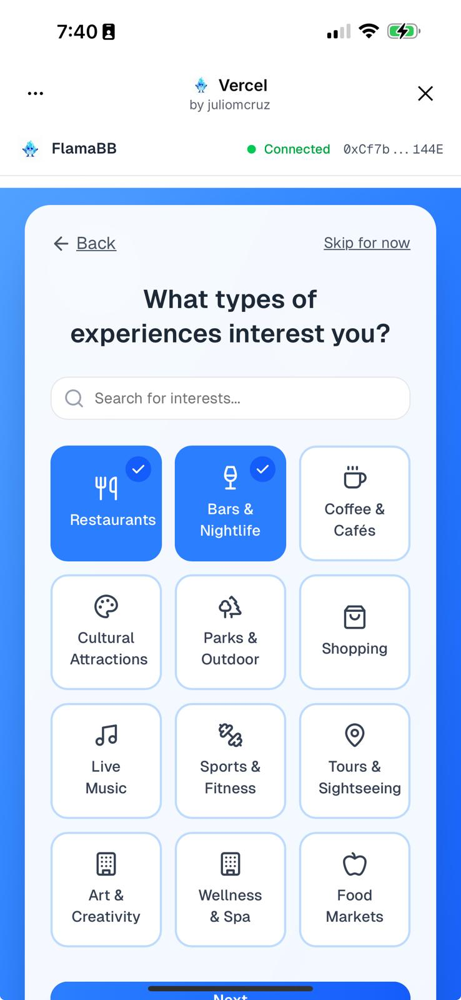
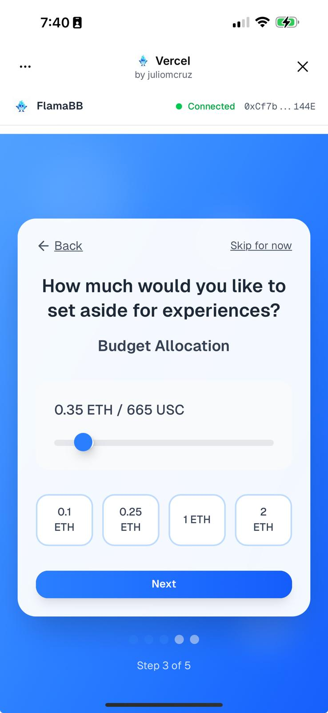
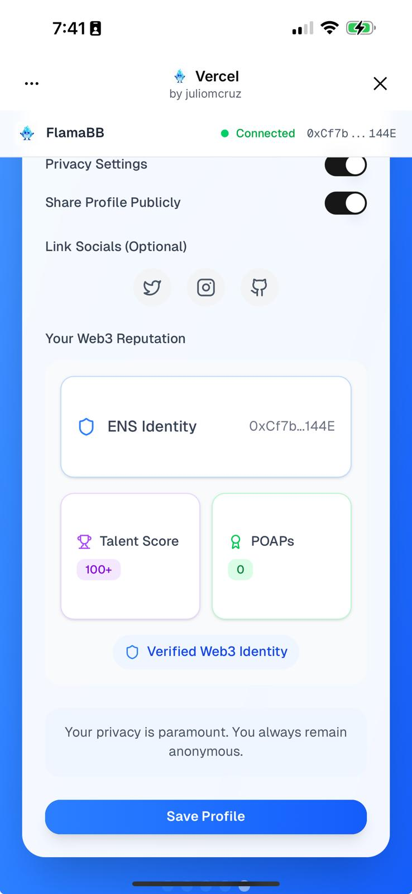
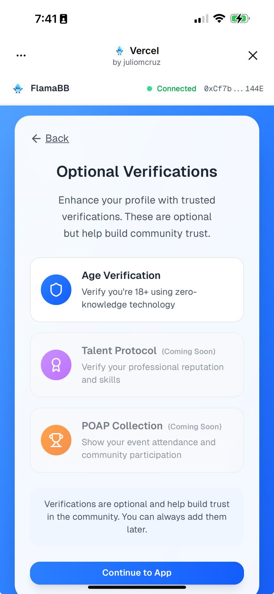
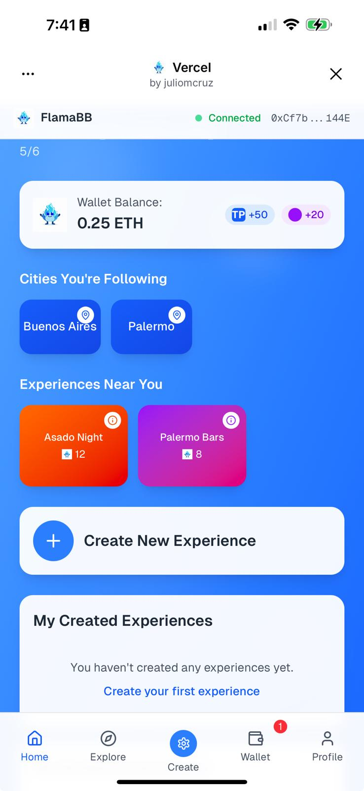
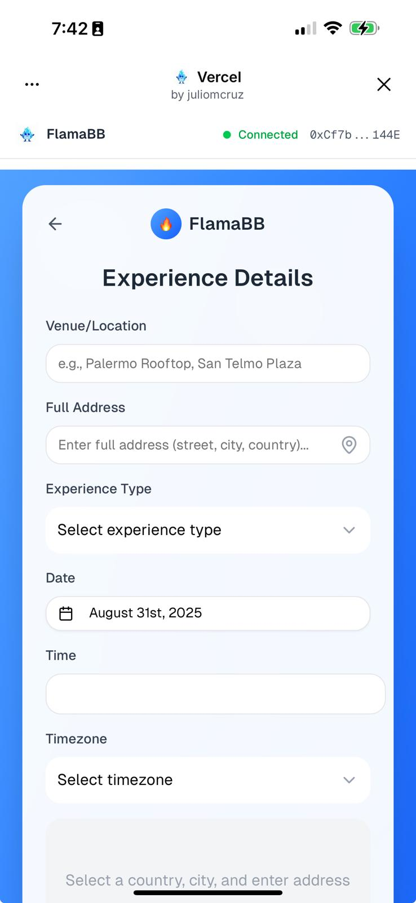
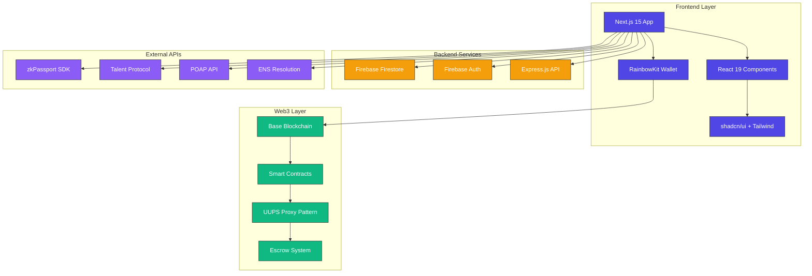
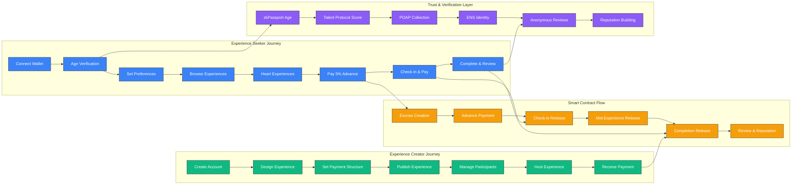
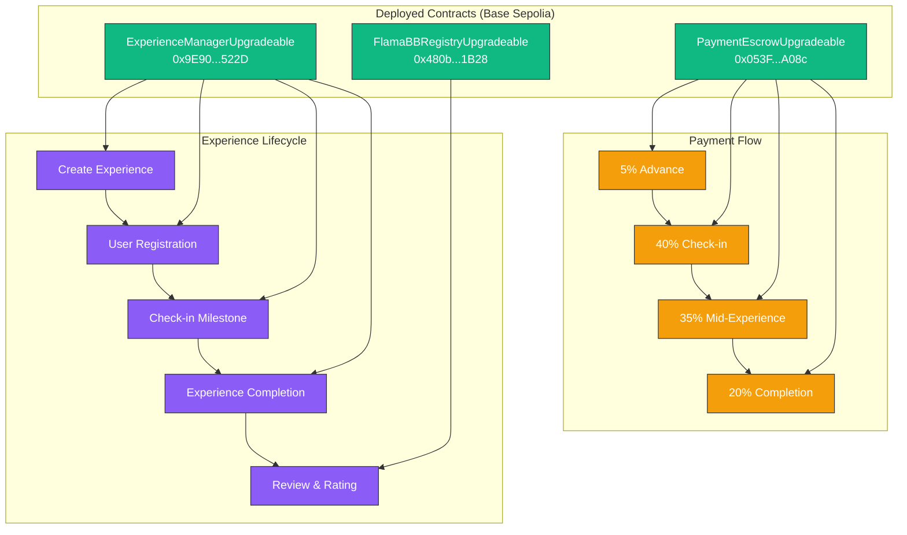

# 🔥 FlamaBB - Passion for Beautiful Experiences

**The First Web3 Social Platform for Authentic Urban Experiences**

*Built for the [Aleph Hackathon](https://dorahacks.io/hackathon/aleph-hackathon/detail) - Connecting communities through shared experiences on Base blockchain*


**🌐 [Try FlamaBB Web App](https://flamabb.vercel.app) | 🎯 [Open in Farcaster](https://farcaster.xyz/juliomcruz/0x11d9f632)**

## 📱 App Screenshots

<div align="center" style="display: flex; flex-wrap: wrap; gap: 20px; justify-content: center; margin: 20px 0;">
  
  
  
</div>

<div align="center" style="display: flex; flex-wrap: wrap; gap: 20px; justify-content: center; margin: 20px 0;">
  
  
  
</div>

<div align="center" style="display: flex; flex-wrap: wrap; gap: 20px; justify-content: center; margin: 20px 0;">
  
</div>

## 🎯 What is FlamaBB?

**FlamaBB is like Airbnb meets Meetup, but for authentic local experiences - powered by Web3.**

Imagine you're visiting Buenos Aires and want to experience a real Argentine asado (BBQ), not a tourist trap. Or you're a local who knows the best hidden bars in Palermo and wants to share that knowledge while earning crypto. FlamaBB makes this happen safely, transparently, and anonymously.

**The Problem We Solve:**
- 🚫 Tourist experiences are overpriced and inauthentic  
- 🚫 Meeting locals is difficult and unsafe for travelers
- 🚫 Local experts have no easy way to monetize their knowledge
- 🚫 Trust between strangers is hard to establish
- 🚫 Payment disputes and scams are common

**Our Solution:**
- ✅ **Authentic Experiences**: Real locals create genuine cultural activities
- ✅ **Safe Connections**: Anonymous profiles with reputation scores
- ✅ **Trust Through Crypto**: Smart contracts ensure fair payments
- ✅ **Privacy First**: Be anonymous until you choose to reveal yourself
- ✅ **Community Driven**: Reviews and ratings build trust

## 🌟 How FlamaBB Works (Simple Version)

**Think of it as three main flows:**

1. **👤 Join Experiences** - Find and book authentic local activities
2. **🎨 Create Experiences** - Host activities and earn crypto
3. **💫 Anonymous Social** - Build reputation while staying private

**The Magic:** Everyone starts anonymous, but can choose to reveal their ENS name when booking experiences. Smart contracts handle all payments automatically, and Web3 reputation systems (Talent Protocol scores, POAP collections) let you trust strangers without revealing personal information.

## 🎯 Hackathon Tracks

This project is submitted to multiple tracks of the Aleph Hackathon:

- **[Base Track](https://dorahacks.io/hackathon/aleph-hackathon/base)** - Built on Base blockchain for transparent and efficient transactions
- **[v0 by Vercel Track](https://dorahacks.io/hackathon/aleph-hackathon/v0-by-vercel)** - Developed entirely using v0 for rapid prototyping and beautiful UI
- **[ENS Track](https://dorahacks.io/hackathon/aleph-hackathon/ens)** - Utilizing ENS as resolver for POAP count and Talent Protocol data

## ✨ Key Features

### 🔐 User Authentication & Verification
- **Wallet Connection**: Seamless Web3 wallet integration
- **Age Verification**: zkPassport integration ensuring users are 18+ years old
- **Profile Verification**: Talent Protocol scores and POAP collection display
- **Anonymous Profiles**: Privacy-first approach with nickname-based interactions

### 💝 Experience Discovery
- **Interest-Based Matching**: Users select preferences (food, bars, culture, etc.)
- **City-Focused**: Buenos Aires experiences including asados, bar tours, walking tours
- **Wishlist System**: Heart/like experiences to save for later
- **Community Engagement**: See flamitas (interest indicators) from other users

### 💰 Innovative Payment System
- **5% Advance Payment**: Show genuine interest by paying 5% of experience cost
- **Flexible Payment Structure**: Experience creators set check-in and mid-experience payment percentages
- **Transparent Escrow**: Smart contracts hold funds until experience completion
- **Automatic Distribution**: Seamless fund transfers based on participation milestones

### 🎨 Experience Creation
- **Easy Setup**: Multi-step flow for creating experiences
- **Flexible Pricing**: Set your own rates and payment structure
- **Participant Management**: Control maximum participants and requirements
- **Rich Media**: Add photos and detailed descriptions

### 📊 Community Features
- **Anonymous Reviews**: 1-5 flama rating system
- **Web3 Reputation System**: Integrated Talent Protocol scores and POAP collections
- **ENS Identity Display**: Optional ENS name and avatar resolution
- **Trust Indicators**: Verified Web3 reputation without revealing personal information
- **Privacy Controls**: Users remain anonymous while building reputation

## 🎨 Design & Aesthetics Philosophy

### 🎭 Visual Identity
FlamaBB embodies the vibrant spirit of Buenos Aires through carefully crafted design language that balances professionalism with Latin warmth.

**Color Palette:**
- **Primary Blue Gradient**: `#3B82F6` to `#1E40AF` - Trustworthy, professional, Web3-native
- **Accent Colors**: Warm oranges and purples for flamitas (❤️) and community elements
- **Background**: Soft gradients with floating blur elements for depth and movement
- **Text**: High-contrast grays (`#1F2937`, `#6B7280`) for optimal readability

**Typography & Spacing:**
- **Geist Font Family**: Modern, clean, and highly readable across all devices
- **Mobile-first Approach**: Maximum width 384px ensures perfect mobile experience
- **Generous Whitespace**: Breathing room between elements reduces cognitive load
- **Card-based Layout**: Rounded corners (`rounded-2xl`, `rounded-3xl`) create friendly, approachable UI

### 🌊 Motion & Interactions

**Smooth Animations:**
- **Tailwind Animate**: Hover effects, transitions, and micro-interactions
- **Transform Scaling**: `hover:scale-[1.02]` on buttons creates satisfying feedback
- **Color Transitions**: Smooth gradient shifts on interactive elements
- **Loading States**: Elegant spinners and skeleton loading for better UX

**User Experience Principles:**
- **Progressive Disclosure**: Complex information revealed step-by-step
- **Immediate Feedback**: Visual confirmation for every user action
- **Error Prevention**: Clear validation and helpful error messages
- **Accessibility**: WCAG-compliant colors, keyboard navigation, semantic HTML

### 📱 Mobile-Centric Design

**Responsive Strategy:**
- **Single-column Layout**: Optimized for thumb navigation
- **Bottom Navigation**: Easy access to primary features
- **Touch-friendly**: Minimum 44px touch targets
- **PWA-ready**: App-like experience on mobile devices

**Component Hierarchy:**
- **Cards**: Primary content containers with subtle shadows and blur effects
- **Buttons**: Gradient backgrounds with clear call-to-action hierarchy  
- **Forms**: Multi-step flows with progress indicators
- **Navigation**: Bottom tabs with active state indicators

### 🎯 User Interface Patterns

**Onboarding Experience:**
- **Step Indicators**: Clear progress visualization (1 of 6, 2 of 6...)
- **Skip Options**: Flexibility without abandonment
- **Visual Metaphors**: Icons and emojis for quick comprehension
- **Contextual Help**: Just-in-time information and tips

**Experience Browsing:**
- **Grid Layout**: 3-column card grid for efficient space usage
- **Rich Media**: High-quality images with overlay information
- **Heart System**: One-tap favoriting with visual feedback
- **Filter & Search**: Intuitive discovery tools

**Trust Indicators:**
- **Reputation Badges**: Subtle display of Talent Protocol scores (100+)
- **POAP Counts**: Community participation indicators (100+)
- **Review Stars**: 1-5 flama rating system with fire emoji
- **Verified States**: Green checkmarks for completed verifications

### 🌈 Emotional Design

**Personality Traits:**
- **Warm & Welcoming**: Like being invited to a friend's home
- **Trustworthy**: Bank-level security with friendly presentation
- **Adventurous**: Encourages exploration and discovery
- **Inclusive**: Accessible to all cultures, languages, abilities

**Micro-copy & Tone:**
- **Conversational**: "Let's explore Buenos Aires together!"
- **Encouraging**: "You're doing great!" progress messages
- **Clear & Direct**: No jargon, simple explanations
- **Culturally Aware**: Buenos Aires references and local flavor

### 🔥 FlamaBB Brand Elements

**Logo & Mascot:**
- **FlamaBB Mascot**: Friendly character representing community and warmth
- **Fire Emoji Integration**: 🔥 symbol throughout the experience
- **Consistent Branding**: Logo placement and sizing across all screens

**Iconography:**
- **Lucide React**: Consistent, beautiful icon system
- **Cultural Symbols**: Argentine and local Buenos Aires references
- **Intuitive Meanings**: Universal symbols for global accessibility
- **Custom Flamitas**: Heart/fire hybrid for community engagement

## 🛠 Technology Stack

### Frontend
- **Next.js 15** - React framework with App Router
- **TypeScript** - Type-safe development
- **Tailwind CSS v4** - Modern styling with design system
- **shadcn/ui** - Beautiful, accessible UI components
- **v0 by Vercel** - AI-powered development platform

### Blockchain & Web3
- **Base Blockchain** - Layer 2 solution for efficient transactions
- **Smart Contracts** - Escrow and payment management
- **Wallet Integration** - Web3 wallet connectivity

### Identity & Verification
- **zkPassport** - Zero-knowledge age verification (18+ years)
- **ENS (Ethereum Name Service)** - Domain name resolution, avatar display, and identity verification
- **Talent Protocol API** - Builder reputation scoring system with real-time data fetching
- **POAP API** - Proof of Attendance Protocol integration with collection statistics

### Development Tools
- **v0 by Vercel** - Primary development platform
- **Vercel** - Deployment and hosting
- **Git** - Version control

## 🏗 Architecture

### System Architecture Diagram



### User Role & Workflow Diagram



### Smart Contract Architecture



## 🚀 Getting Started

### Prerequisites
- Node.js 18+ 
- Web3 wallet (MetaMask, WalletConnect, etc.)
- Base network access

### Installation

1. **Clone the repository**
   ```bash
   git clone https://github.com/your-team/flamabb
   cd flamabb
   ```

2. **Install dependencies**
   ```bash
   npm install
   ```

3. **Set up environment variables**
   ```bash
   cp .env.example .env.local
    Add your environment variables including:
    - Talent Protocol API key
    - POAP API key (optional)
    - Base Sepolia testnet RPC URLs
    - ENS resolution RPC URL (mainnet)
   ```

4. **Run the development server**
   ```bash
   npm run dev
   ```

5. **Open your browser**
   Navigate to `http://localhost:3000`

## 🚀 Quick Start - Try FlamaBB Now!

### 📱 Experience FlamaBB in 5 Minutes
Ready to discover authentic Buenos Aires? Here's your lightning-fast path to your first experience:

**👉 [Launch FlamaBB](https://flamabb.vercel.app) 👈**

**🎯 Try as Farcaster Mini App: [Open in Farcaster](https://farcaster.xyz/juliomcruz/0x11d9f632) 👈**

1. **🔗 Connect Wallet** - MetaMask, WalletConnect, or any Web3 wallet
2. **🆔 Age Verification** - Quick zkPassport verification (18+ required, dev mode enabled)
3. **🌍 Choose Cities** - Select Buenos Aires + future cities to explore  
4. **🎯 Set Interests** - Food, bars, culture, outdoor activities, shopping
5. **💰 Budget Setup** - Allocate ETH for experiences (starts at 0.1 ETH)
6. **👤 Anonymous Profile** - Create your private identity
7. **❤️ Explore & Heart** - Browse authentic experiences and save favorites
8. **🎉 Book Experience** - Pay 5% to secure your spot and optionally reveal ENS!

**⚡ From zero to booked authentic experience in under 5 minutes!**

---

## 🎮 Complete User Workflows

### 🏁 Initial Onboarding (6-Step Process)

**Step 1: Wallet Connection**
- Connect Web3 wallet using RainbowKit integration
- Support for MetaMask, WalletConnect, Coinbase Wallet
- Base network configuration for optimal gas fees

**Step 2: Age Verification (zkPassport Integration)**
- Zero-knowledge proof verification you're 18+ years old
- Privacy-preserving: no personal data stored or exposed
- Dev mode enabled with 6 mock passports for testing
- QR code + mobile link for seamless verification

**Step 3: City Selection**
- Choose Buenos Aires (MVP city) and future expansion cities
- Paris, Tokyo, London, Singapore, Dubai, Sydney planned
- Interest-based city matching for personalized recommendations

**Step 4: Interest Preferences**
- Select from curated experience categories:
  - 🍽️ Restaurants & Traditional Food (Asados, Parrillas)
  - ☕ Bars & Nightlife (Palermo, San Telmo scenes)
  - 🏛️ Cultural Attractions (Recoleta, Museums)
  - 🎨 Art & Street Culture (Murals, Galleries)
  - 🏔️ Outdoor Activities (Parks, Walking tours)
  - 🛍️ Shopping & Local Markets

**Step 5: Budget Allocation**
- Set ETH allocation for experiences (0.1 to 2+ ETH)
- Real-time USD conversion display
- Suggested amounts: 0.1, 0.25, 1.0, 2.0 ETH
- Custom slider for precise control

**Step 6: Anonymous Profile Creation**
- Choose avatar (4 gradient options with emojis)
- Set anonymous display name (e.g., "FlamaFan22")  
- Write optional bio/description
- Privacy controls and public sharing preferences
- Optional social links (Twitter, Instagram, GitHub)

### 👥 Experience Discovery & Joining

**Browse & Explore**
- **Anonymous Discovery**: Browse all experiences while completely anonymous
- **Interest Matching**: See experiences tailored to your preferences
- **Community Indicators**: View "flamitas" (❤️) from other users
- **Reputation Signals**: See creator's Talent Protocol score (100+ format) and POAP count (100+ format)
- **Rich Media**: Photos, detailed descriptions, pricing, location

**Wishlist & Favorites**
- **Heart Experiences**: Free favoriting system (no payment required)
- **Save for Later**: Build personal wishlist of interesting experiences
- **Notification System**: Get notified when favorited experiences become available

**Booking Process**
- **5% Advance Payment**: Show genuine interest with small upfront payment
- **Identity Choice**: Choose to remain anonymous OR reveal your ENS name
- **Smart Contract Escrow**: Funds held safely until experience completion
- **Automatic Confirmation**: Instant booking confirmation and details

**Experience Participation**
- **Check-in Process**: GPS-based or QR code check-in at experience location
- **Mid-Experience Payments**: Additional payments based on creator's structure
- **Social Interaction**: Meet other participants (some anonymous, some revealed)
- **Real-time Updates**: Creator can share updates, photos, information

**Post-Experience**
- **Anonymous Reviews**: Rate 1-5 flamas without revealing identity
- **Automatic Payment Release**: Smart contract releases remaining funds to creator
- **POAP Rewards**: Potential proof-of-attendance protocol rewards
- **Reputation Building**: Your anonymous profile gains trust score

### 🎨 Experience Creation Workflow

**Prerequisites**
- **Complete User Onboarding**: Must finish all 6 steps as regular user first
- **Understand Platform**: Experience the app from participant perspective

**Creator Mode Activation**
- **Profile Switch**: Access creator tools from your anonymous profile
- **Reputation Check**: Platform validates your Talent Protocol score and POAP count
- **Local Verification**: Ensure you're creating experiences in your city (Buenos Aires for MVP)

**Experience Design Process**
1. **Basic Information**
   - Experience title and compelling description
   - Category selection (food, bars, culture, outdoor, shopping)
   - Duration and time of day preferences
   - Language options (Spanish, English)

2. **Location & Logistics**
   - Specific Buenos Aires neighborhood (Palermo, San Telmo, Recoleta, etc.)
   - Meeting point with GPS coordinates
   - Maximum participant count (2-20 people typically)
   - Accessibility information and requirements

3. **Rich Media Content**
   - Upload experience photos (venue, food, activities)
   - Add video previews or virtual tours
   - Create photo galleries showing previous experiences

4. **Pricing & Payment Structure**
   - Set base price in ETH with USD conversion
   - Configure payment milestones:
     - 5% advance payment (mandatory)
     - Check-in payment percentage (customizable)
     - Completion payment percentage (remaining amount)
   - Optional tips and bonus structures

5. **Experience Requirements**
   - Age restrictions (18+ enforced by zkPassport)
   - Group size preferences (couples, solo travelers, families)
   - Physical requirements or fitness levels
   - Cultural considerations or dress codes

**Publication & Management**
- **Preview Mode**: Test experience flow before going live
- **Community Review**: Other creators can provide feedback
- **Go Live**: Make experience searchable and bookable
- **Participant Management**: Track bookings, payments, check-ins
- **Communication Tools**: Message participants with updates

**Hosting & Execution**
- **Pre-Experience**: Contact participants, confirm details, share final information
- **Day-of Hosting**: Lead the group, ensure safety, create memorable moments
- **Real-time Updates**: Share photos, stories, highlights during experience
- **Completion**: Confirm all participants, trigger final payment release

**Post-Experience**
- **Automatic Payments**: Smart contract releases funds based on successful completion
- **Review Collection**: Receive anonymous feedback from participants
- **Reputation Building**: Gain creator credibility and higher visibility
- **Repeat Bookings**: Successful experiences get featured for repeat hosting

### 💫 Privacy & Anonymity System

**Default Anonymous State**
- **All users start completely anonymous** - no real names, emails, or personal data
- **Display names only**: Creative usernames like "PalermoExplorer" or "AsadoLover22"
- **Reputation without Identity**: Build trust through actions, not personal information

**Selective Identity Reveal**
- **ENS Integration**: Users with ENS domains can choose to reveal their .eth name
- **Payment-Gated**: Revealing ENS costs the 5% booking fee (shows commitment)
- **Reversible**: Can return to anonymous state for future experiences
- **Partial Reveal**: Show ENS to experience group only, not platform-wide

**Trust Through Web3 Reputation**
- **Talent Protocol Scores**: Display rounded scores (119 points shows as "100+")
- **POAP Collections**: Show participation level (119 POAPs shows as "100+") 
- **Experience History**: Anonymous track record of successful participations
- **Community Ratings**: Aggregate flama ratings without revealing raters

**Why Anonymity Matters**
- **Safety for Travelers**: Visit new cities without revealing personal information
- **Celebrity Privacy**: Public figures can explore without recognition pressure  
- **Social Freedom**: Break free from existing social circles and try new things
- **Reduced Bias**: Interactions based on interests and compatibility, not status
- **Protection from Harassment**: Especially important for women travelers and marginalized groups

## 👥 Team

Our diverse team of fullstack developers brings together expertise in Web3, frontend development, and user experience:

- **[Ileana](https://github.com/ileana-pr)** - Fullstack Developer
- **[0xOucan](https://github.com/0xOucan)** - Fullstack Developer  
- **[Julio M Cruz](https://github.com/JulioMCruz)** - Fullstack Developer

## 🔗 Important Links

### Hackathon
- [Aleph Hackathon Main](https://dorahacks.io/hackathon/aleph-hackathon/detail)
- [Base Track](https://dorahacks.io/hackathon/aleph-hackathon/base)
- [v0 Track](https://dorahacks.io/hackathon/aleph-hackathon/v0-by-vercel)
- [ENS Track](https://dorahacks.io/hackathon/aleph-hackathon/ens)

### Documentation
- [zkPassport Documentation](https://docs.zkpassport.id/intro)
- [zkPassport Age Verification](https://docs.zkpassport.id/examples/age-verification)
- [Base Documentation](https://docs.base.org/)
- [ENS Documentation](https://docs.ens.domains/)

## 🌟 Why FlamaBB?

### Innovation
- **First** Web3 platform specifically designed for urban experience sharing
- **Unique** payment structure that builds trust between strangers
- **Privacy-focused** while maintaining community accountability

### Social Impact
- **Community Building** - Connects people through shared interests
- **Local Economy** - Supports local experience creators and venues
- **Cultural Exchange** - Promotes authentic local experiences
- **Public Good Model** - Sustainable development with community giving back

### Technical Excellence
- **Built on Base** - Fast, cheap, and reliable transactions
- **Modern Stack** - Latest Web3 and frontend technologies
- **User-Centric** - Intuitive design built with v0

## 🌍 Public Good Commitment

FlamaBB operates as a **Public Good** with a sustainable and community-focused revenue model:

### 💰 Revenue Structure
- **Platform Fee**: 0.5% commission per experience booking
- **Soft Cap**: $1,000 USD monthly revenue target
- **Team Distribution**: $250 USD per developer (3 developers = $750 USD)
- **Infrastructure**: $250 USD for operational costs

### 🎁 Community Giving
Once we reach our monthly soft cap of $1,000 USD, **100% of additional revenue is donated** to local charitable causes:

- **Buenos Aires Focus**: Child cancer non-governmental organizations
- **Transparent Donations**: Public record of all charitable contributions
- **Community Choice**: Local communities help select beneficiary organizations
- **Global Expansion**: Similar local charity partnerships in each new city

This model ensures FlamaBB remains sustainable while maximizing positive social impact in every community we serve.

## 🎉 Special Thanks

Huge appreciation to **v0 by Vercel** for making this project possible! The AI-powered development experience allowed us to rapidly prototype and build a beautiful, functional application in record time. We love you v0! 💙

## 📄 License

This project is licensed under the MIT License - see the [LICENSE](LICENSE) file for details.

## 🤝 Contributing

We welcome contributions! Please see our [Contributing Guidelines](CONTRIBUTING.md) for details.

---

**Built with ❤️ for the Aleph Hackathon | Powered by Base, v0, and ENS**

